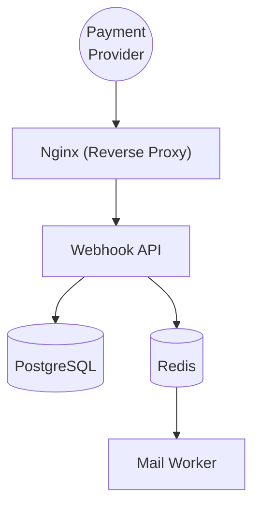
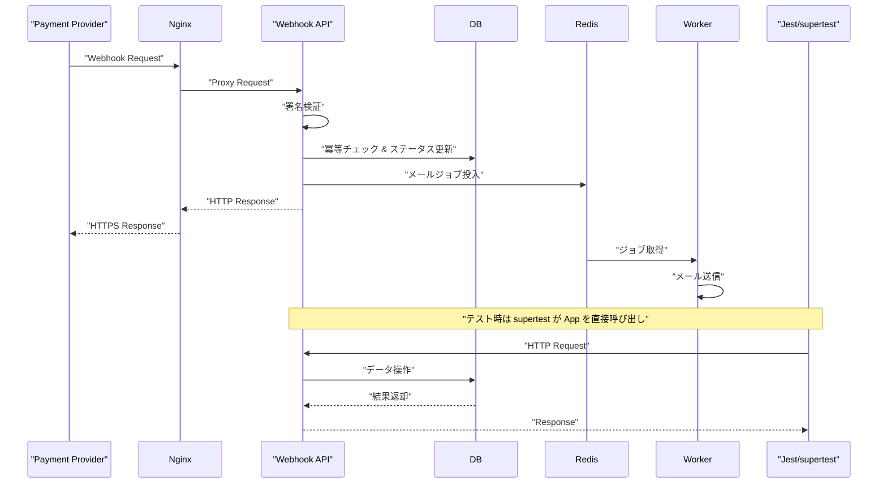

# Webhook Payment Gateway

本プロジェクトは、外部決済プロバイダーからのWebhook通知をセキュアに受信し、受注ステータスの更新とメール通知を非同期(Queue→Worker)で処理するシステムです。

## API仕様
| メソッド | エンドポイント | 機能 | 認証 |
| :--- | :--- | :--- | :--- |
| POST | /webhook/payment | 決済Webhook受信 | 署名検証あり |

### API利用例 (Webhook受信)
```bash
curl -X POST https://localhost/api/webhook/payment \
  -H "x-signature: <SIGNATURE>" \
  -H "Content-Type: application/json" \
  -d '{
    "event_id": "evt_123",
    "order_id": "ord_1",
    "status": "PAID",
    "email_addr": "customer@example.com"
  }' -k
```

## 技術スタック
- **Language**: TypeScript (6.0.3)
- **Runtime**: Node.js v22 LTS
- **Framework**: Express (5.2.1)
- **Database**: PostgreSQL 16
- **ORM**: Prisma (7.8.0)
- **Queue/Worker**: Redis, BullMQ (5.79.3)
- **Email**: Nodemailer (9.0.3)
- **Proxy**: Nginx
- **Logger**: Pino (10.3.1)
- **Testing**: Jest (30.4.2), supertest (7.2.2)
- **Container**: Docker, Docker Compose
- **CI/CD**: GitHub Actions(ci.yml)

## システム構成

### Docker構成図



### Webhook受信処理フロー



## 工夫した点
- **セキュリティ**: NginxによるHTTPS通信と、署名検証ミドルウェアによる不正リクエストの遮断。
- **冪等性**: `webhookEvent` テーブルによる同一イベントの重複処理防止。
- **非同期処理**: BullMQを用いたメール送信のキューイングによる、APIレスポンスの高速化とリトライ制御。
- **型安全性**: TypeScriptの厳格な設定とPrismaによる型安全なDB操作。

## ローカル起動手順 ※ <a href="https://drive.google.com/file/d/1EfsLKyYFte4uD7OA5_0_8qZZIfwcoiYL/view?usp=sharing" target="_blank" rel="noopener noreferrer">🎦動画あり (ローカル起動・テスト)</a>
1. **githubからダウンロード**
   ```bash
   git clone https://github.com/nan0111/todo-node-api.git
   cd webhook-payment-gateway
   ```

2. **環境変数の設定**
   `.env.example` を `.env` にコピーし、以下の環境変数を設定してください。
   ```bash
   cp .env.example .env
   ```
   - `DATABASE_URL`: PostgreSQL接続文字列
   - `REDIS_URL`: Redis接続文字列
   - `WEBHOOK_SECRET`: Webhook署名検証用シークレット
   - `SMTP_HOST`, `SMTP_PORT`, `SMTP_USER`, `SMTP_PASS`: メール送信設定

3. **コンテナの起動**
   ```bash
   docker compose up --build -d
   ```

## ローカルテスト手順
1. **テスト実行**
   ```bash
   docker compose exec -T app npm test
   ```

## ディレクトリ構成
```text
.
├── nginx/        # リバースプロキシ設定
├── prisma/       # DBスキーマ・マイグレーション
├── src/          # アプリケーションソースコード
│   ├── util/         # ユーティリティ
│   ├── middlewares/  # 署名検証等
│   ├── workers/      # バックグラウンド処理
│   ├── config/       # 設定ファイル
│   └── types/        # 型定義
└── tests/        # テストコード
```

## ライセンス
MIT License
